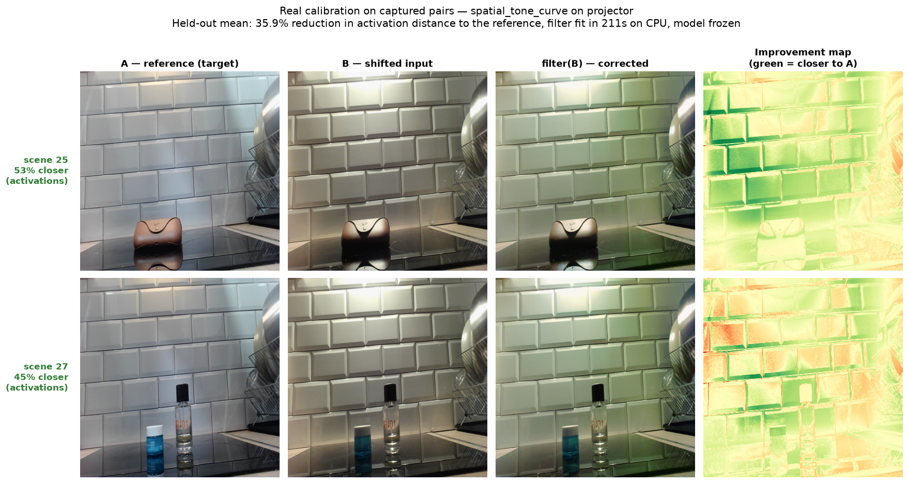
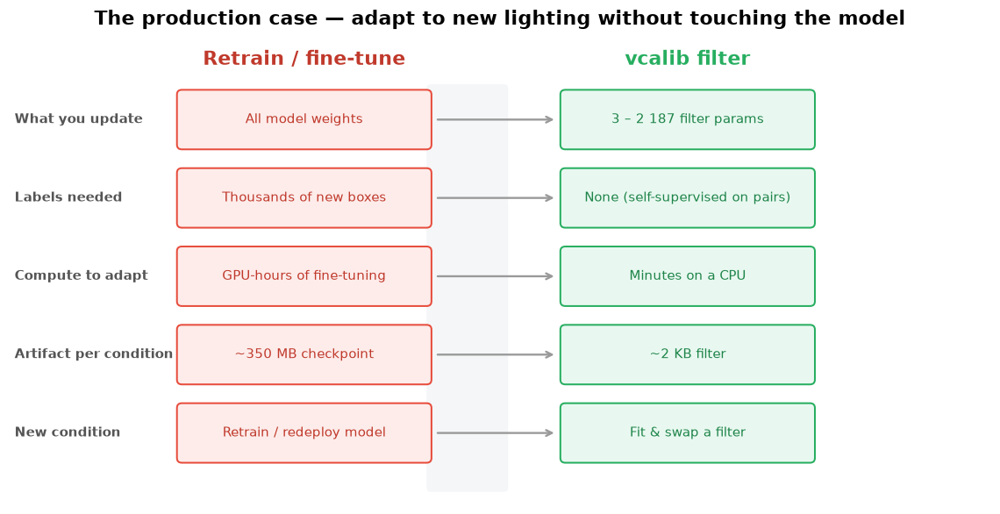
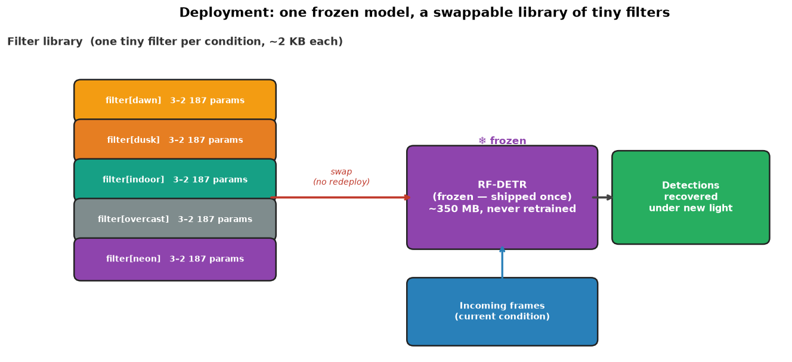
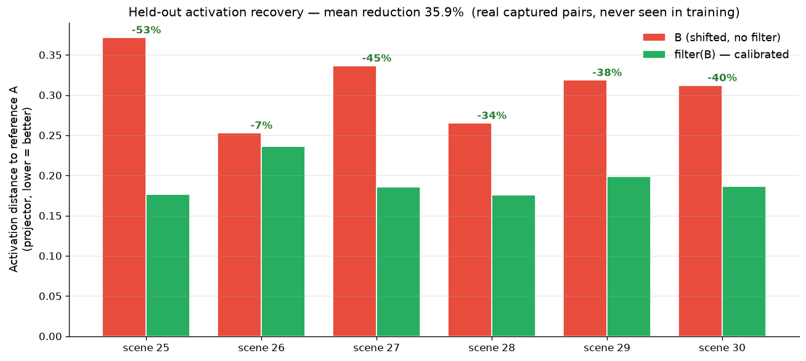
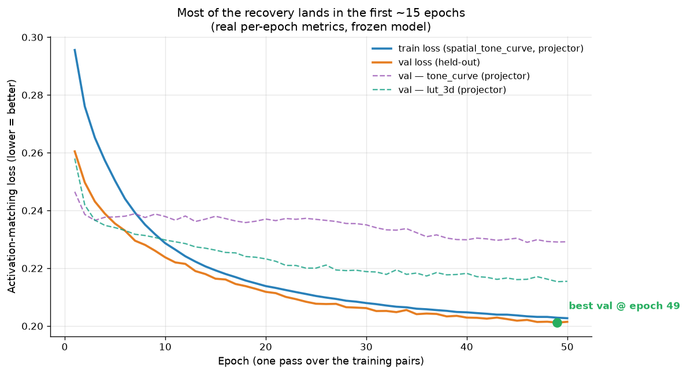
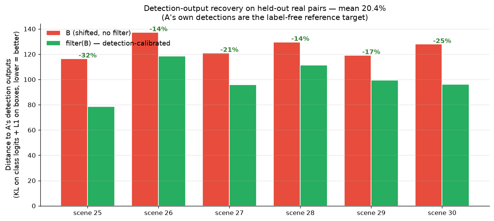
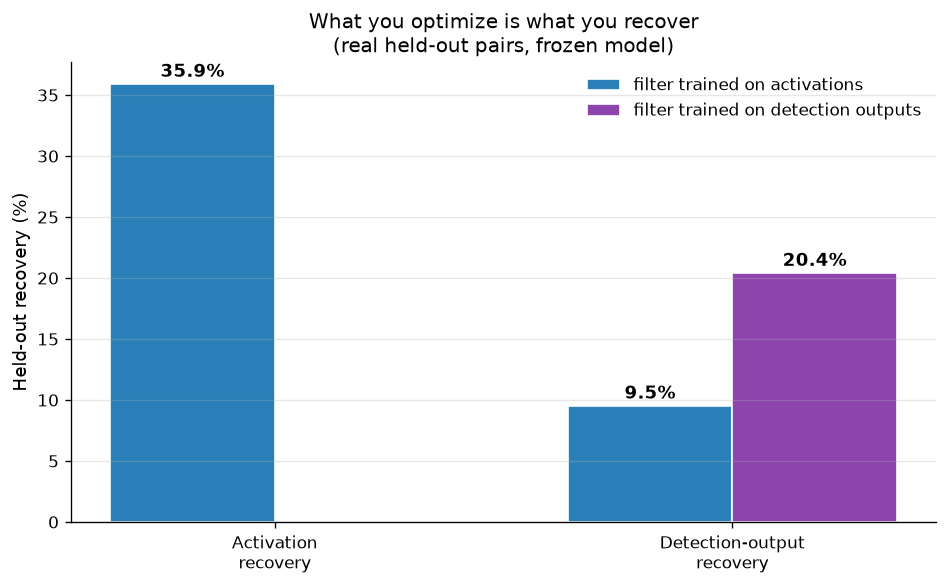

# vcalib — Differentiable Calibration Filters for RF-DETR Under Illumination Shift

> **Stop retraining your detector when the lighting changes.** Fit a ~2 KB filter in minutes on a CPU instead — the model stays frozen.

---

vcalib learns a tiny preprocessing filter that undoes an illumination shift *before* the image reaches a frozen object detector. No model weights are touched. On **real captured image pairs, held out from training**, a single spatial tone-curve filter pulls the shifted image's internal representation **35.9% closer** to the reference — fit in ~3.5 min on a laptop CPU.



*Left to right: the reference condition **A**, the same scene under shifted lighting **B**, the filter-corrected `filter(B)`, and where the filter helped (green = closer to A). These are real held-out scenes the filter never saw during training.*

---

## Why this matters (the production case)

Think about what it costs to keep a detector working as conditions drift — dawn vs. dusk, indoor vs. overcast, a new camera, a new site. The textbook answer is "collect data, label it, fine-tune, redeploy." That is the expensive answer.

vcalib proposes the cheap one: **freeze the expensive model once, and adapt to each new condition with a tiny, label-free filter.** It's the same economic logic that made LoRA/adapters win in NLP — only here we adapt the model's *input* instead of its weights.



In deployment this becomes **one frozen model + a swappable library of tiny filters**, one per condition. Switching conditions is swapping a 2 KB file — no retraining, no redeploy.



> **Why we're excited:** if this holds at the *detection-metric* level (our next milestone — see [What's proven vs. what's next](#whats-proven-vs-whats-next)), then keeping a model healthy in the field stops being a retraining problem and becomes a *calibration* problem — orders of magnitude cheaper, no labels, runs on the edge.

---

## The Problem

RF-DETR is a state-of-the-art real-time object detector. Like most vision models, it is sensitive to illumination: deploy it under lighting different from its training distribution and detection quality degrades. Retraining or fine-tuning is expensive and impractical for edge devices.

The images below show one scene captured under three real lighting conditions — exactly the kind of shift that moves a model's internal features off-distribution:


---

## How it works


```
Raw Image B (shifted illumination)
        │
        ▼
┌───────────────────┐
│  Learnable Filter  │  ← optimized in ~100 steps per image pair
│  f: [0,1]³→[0,1]³ │    params: 3–2,187 (depending on filter type)
└───────────────────┘
        │
        ▼
ImageNet normalization
        │
        ▼
┌─────────────────────┐        ┌─────────────────────┐
│  RF-DETR  (frozen)  │        │  Reference activations│
│                     │        │  (precomputed from A) │
│  → activations      │◄──────►│                      │
└─────────────────────┘        └─────────────────────┘
        │
        ▼
Loss = mean{ ||act_A[l] - act_filtered_B[l]|| / ||act_A[l]|| }
       for l in chosen layer group
     + reg_weight · filter.reg_loss()
        │
        ▼
Adam optimizer → filter params updated, model frozen
```

**Key design choices:**

- **Signal = intermediate activations, not pixel L2.** We match RF-DETR's internal representations, not raw pixels. That makes the objective *task-aware* without needing any labels — the filter optimizes for what the detector actually keys on, not for human-perceived color. This is the crucial difference from a classic white-balance / ISP correction.
- **Filter operates pre-normalization** on the `[0, 1]` RGB tensor, before ImageNet mean/std normalization.
- **No model weights modified.** The frozen model is a fixed feature extractor; only the filter is learnable.
- **Layer group as a search axis.** We sweep which group of RF-DETR layers feeds the loss. The `backbone.projector` consistently wins.
- **Held-out validation guardrail.** Every calibration is evaluated on held-out pairs to catch overfitting. An overfit gate (val/train ≥ 0.5) rejects degenerate configs.

---

## Results on real captured pairs

The headline figure above and the chart below come from training the top filter (`spatial_tone_curve`, P=16, K=5, on `projector`) on **24 real captured scenes** and evaluating on **6 scenes held out entirely from training**.



| | Result |
|---|---|
| Mean activation-distance reduction (6 held-out scenes) | **35.9%** |
| Per-scene range | 6.5% – 52.6% |
| Filter parameters | 1,200 |
| Fit time | ~211 s on a laptop CPU (24 pairs, 60 epochs) |
| Model weights changed | **0** |

And it converges fast — most of the recovery lands in the first ~15 epochs (real per-epoch metrics):



---

## Does it recover *detection*, not just activations?

Activation distance is a proxy. The question a practitioner actually cares about is whether the model *detects the same things* under the shift. We measure this **without any hand labels**: we treat the frozen model's own detections under the reference condition **A** as the target, and ask how far the detection outputs (class logits + boxes) drift under **B** vs. `filter(B)`.

On the 6 held-out real scenes, a filter calibrated against the detection objective pulls the detection outputs **20.4% closer to A** — every scene improves:



And there's a clean, honest lesson in the data: **what you optimize is what you recover.** The activation-trained filter is great at activation recovery (35.9%) but only modestly recovers detection outputs (9.5%); calibrating against the detection objective roughly doubles detection recovery (20.4%).



> This is detection-*output* agreement against a self-supervised reference — strong evidence that the effect reaches the detection head, but not yet a mAP number against human-annotated ground truth. That last step is what closes the loop (see below).

---

## Results (200-Config Sweep)

> 10 filter types × 2 illumination levels × 10 layer groups, evaluated on 6 held-out test scenes (synthetically relighted, used as a fast proxy).
> Metric: mean activation-distance reduction on the test set (higher = better).

### Top Configurations

| Rank | Filter | Layer Group | Level | Test Reduction |
|------|--------|-------------|-------|---------------|
| 1 | `spatial_tone_curve` (P=8, K=3) | `projector` | L1→L2 | **30.7%** |
| 2 | `lut_3d` (N=9) | `projector` | L1→L2 | 29.6% |
| 3 | `tone_curve` (P=16) | `projector` | L1→L2 | 24.1% |
| 4 | `ccm_high_order` | `projector` | L1→L2 | 23.7% |
| 5 | `lut_3d` (N=9) | `projector` | L1→L3 | 23.9% |
| 6 | `spatial_tone_curve` (P=8, K=3) | `projector` | L1→L3 | 21.6% |
| 7 | `lut_3d` (N=9) | `backbone.late+proj` | L1→L2 | 21.0% |

### Key Findings

**1. Layer group matters more than filter type.**
The `projector` layer (the backbone's multi-scale feature projector) gives the strongest signal across every filter type. Results degrade progressively from late → mid → early backbone layers.


**2. Non-linear filters outperform linear ones.**
Spatial and tone-curve filters capture the non-linear, per-channel character of real illumination shifts better than affine transforms.


**3. The signal generalizes across illumination levels.**
Results on `level_1→level_3` (stronger shift) are slightly lower but follow the same filter/group ranking — the approach isn't tied to one shift magnitude.

The full filter × layer-group matrix (green = better):


Full results: [`results/experiments/experiment_results.csv`](results/experiments/experiment_results.csv) — see [`docs/results_sweep_200.md`](docs/results_sweep_200.md) for the detailed breakdown.

---

## What's proven vs. what's next

We'd rather be precise about what these numbers do and don't show.

**✅ What's proven**
- A tiny, label-free filter measurably pulls a frozen detector's internal representations back toward the reference condition — **35.9% on real held-out captured pairs**, 30.7% across a 200-config synthetic sweep.
- The effect reaches the **detection head**: calibrating against the detection objective recovers **20.4%** of the detection-output drift on held-out real pairs (every scene improves), measured label-free against the model's own reference-condition detections.
- It's cheap: thousands of params, minutes on a CPU, no model retraining, no labels.
- The signal is robust: same ranking across filter families, layer groups, and shift magnitudes — and *what you optimize is what you recover*.

**🔧 What's next (the milestone that closes the loop)**
- **mAP against human ground truth.** We've shown detection-*output* recovery against a self-supervised reference; the final proof is mAP / box-quality on **hand-annotated** shifted data, with a **full-retrain arm** as the upper-bound comparison.
- **Per-condition generalization.** Confirm that one filter, fit once per environment, holds across a whole stream of frames (the deployment model above), not just per-image.
- **Edge deploy CLI** to make "fit & swap a filter" a one-command operation.

---

## FAQ

**Isn't this just white balance / histogram matching?**
No — and that's the point. Classic ISP corrections optimize for human-perceived color. vcalib optimizes a *task-aware* objective: it minimizes the distance between the frozen detector's **activations**, so it corrects exactly what the model cares about. Linear color transforms (`white_balance`, `affine`) are *included* in the filter library and they consistently underperform the non-linear, activation-matched filters.

**Where does the reference A come from at deploy time?**
You capture a small set of A/B pairs once per new environment, fit the filter offline, freeze it, and ship it. At inference you only run `filter(frame) → frozen model`. No reference is needed online.

**Does it actually improve detection, or just activations?**
Both. Beyond the 35.9% activation recovery, a detection-calibrated filter recovers **20.4%** of the drift in the model's *detection outputs* (class logits + boxes) on held-out real pairs — see [Does it recover detection?](#does-it-recover-detection-not-just-activations). The remaining step is mAP against human-annotated ground truth.

**Why freeze the model instead of fine-tuning?**
Cost and operations: no labels, minutes on CPU vs. GPU-hours, a 2 KB artifact vs. a new checkpoint, and one model + N swappable filters instead of N fine-tuned models to maintain.

---

## Filter Library

18 parametric filters + 1 neural network filter, all sharing the same interface:

```python
filter(x: Tensor[B, 3, H, W] in [0,1]) → Tensor[B, 3, H, W] in [0,1]
# identity init: filter(x) == x at construction
# end-to-end differentiable
```

| Category | Filter | Params | Targets |
|----------|--------|--------|---------|
| **Global linear** | `brightness_2param` | 2 | global exposure |
| | `white_balance_3param` | 3 | per-channel gains |
| | `affine_6param` | 6 | per-channel affine |
| | `saturation_1param` | 1 | saturation |
| | `contrast_1param` | 1 | global contrast |
| | `gamma_3param` | 3 | per-channel gamma |
| | `matrix_12param` | 12 | 3×3 CCM + offset |
| **Spatial** | `spatial_brightness` | K²·1 | zone-dependent exposure |
| | `spatial_whitebalance` | K²·3 | zone-dependent WB |
| | `spatial_affine` | K²·6 | zone-dependent affine |
| | `spatial_gamma` | K²·3 | zone-dependent gamma |
| **Non-linear** | `lut_3d` | 3·N³ (N=9→2187) | full RGB→RGB LUT |
| | `tone_curve` | 3·P (P=16→48) | monotone per-channel curves |
| | `ccm_high_order` | 3·F+3 | root-polynomial CCM |
| | `chromatic_adaptation` | 3–9 | Bradford LMS adaptation |
| | `spatial_tone_curve` | 3·P·K² | zone-dependent tone curves |
| | `local_tonemap` | K²+1 | CLAHE-like guided gain |
| | `lut_3d_lowrank` | M·(3N+1) | low-rank LUT |
| **Neural** | `neural_pixel` | ~1283 (configurable) | universal approximator |

Spatial filters use a bilinear K×K control grid (`grid_sample`). Default K=3.
`neural_pixel` is a pixel-wise residual MLP: `f(x) = clamp(x + MLP(x), 0, 1)`, identity-initialized.

---

## Quick Start

### Install

```bash
git clone --recurse-submodules <repo-url>
cd vcalib
uv sync   # creates .venv and installs all deps
```

RF-DETR nano weights download automatically on first run to `3rd_party/libreyolo/weights/`.

### Run a single experiment (dry-run to validate config)

```bash
uv run python run_configs.py configs/experiments/level2_neural_pixel_backbone_all.yaml --dry-run
```

### Run a filter sweep

```bash
uv run python run_configs.py configs/experiments/ --output results/experiments/
```

### Run a single filter against a known-good config

```bash
uv run python run_configs.py configs/experiments/level2_lut3d_projector.yaml
```

### Prepare your own dataset

```bash
# 1. Capture: data/raw/scenes_YYYYMMDD/scene_XXX/{level_1,level_2,...}.jpg
#    level_1 = reference condition A, others = shifted B

# 2. Augment (geometry-preserving)
uv run python scripts/augment_dataset.py \
  --raw data/raw/scenes_YYYYMMDD \
  --out data/augmented --n-aug 5 --seed 42

# 3. Split by illumination level
uv run python scripts/create_datasets.py \
  --augmented data/augmented --out data/datasets
```

### Run tests

```bash
uv run pytest tests/ -v -m "not slow"   # fast (< 5s)
uv run pytest tests/ -v                  # includes smoke calibration (needs data/raw)
```

---

## Project Structure

```
vcalib/
├── src/
│   ├── filters/              # 19 filter implementations + registry
│   │   ├── base.py           # Filter base class (identity init, [0,1] clamping, reg_loss)
│   │   ├── neural_pixel.py   # Pixel-wise residual MLP
│   │   └── ...               # parametric filters
│   ├── utils/
│   │   ├── activations.py    # load_model, ActivationExtractor, LAYER_PATHS
│   │   ├── layer_groups.py   # LayerGroup, 35 predefined groups
│   │   ├── data_pairs.py     # Dataset, discover_pairs, load_pair_tensors
│   │   └── synth_relit.py    # Synthetic relighting for smoke tests
│   ├── calibration.py        # Adam calibration loop, group_loss, overfit gate
│   ├── diagnostics.py        # Phase 1: per-layer distance sweep
│   ├── grid_search.py        # Phase 2: grid executor (legacy)
│   ├── benchmark.py          # Phase 3: proxy mAP recovery (WIP)
│   └── experiment_config.py  # Config schema + loader
├── configs/
│   ├── grid.yaml             # Legacy grid config (35 groups × 17 filters)
│   └── experiments/          # YAML configs (one per experiment)
├── results/
│   └── experiments/
│       ├── experiment_results.csv   # 200-config sweep results
│       └── runs/                    # Per-run checkpoints + metrics.jsonl
├── scripts/
│   ├── augment_dataset.py        # Geometry augmentation preserving A/B pairs
│   ├── create_datasets.py        # Split augmented data by illumination level
│   └── generate_visual_report.py # Per-scene before/after HTML report
├── tests/                    # 222+ tests (fast + slow smoke)
├── docs/
│   ├── images/               # Figures used in this README
│   ├── results_sweep_200.md  # Detailed sweep analysis
│   └── specs/                # Design specs
├── run_configs.py            # Main experiment runner (config-driven)
└── 3rd_party/libreyolo/      # RF-DETR wrapper (git submodule)
```

---

## How Experiments Work

Each experiment is a single YAML config:

```yaml
name: level2_neural_pixel_projector
dataset: data/datasets/level_1_vs_level_2
filter:
  type: neural_pixel
  hidden_dim: 32
  depth: 2
layer_group:
  name: projector
  layers:
  - backbone.projector
training:
  max_epochs: 100
  learning_rate: 0.001
  reg_weight: 0.001
  early_stopping_patience: 10
  seed: 42
```

The runner (`run_configs.py`) loads the model once, iterates configs, and writes incremental results. Each run saves `best.pt` (best filter weights) and `metrics.jsonl` (per-epoch stats) under `results/experiments/runs/<name>/`.

---

## Roadmap

| Phase | Status | Description |
|-------|--------|-------------|
| A | ✅ Complete | Filter library (19 filters), calibration loop, tests |
| B | ✅ Complete | Config-driven experiment runner, YAML configs |
| 1 | ✅ Complete | Diagnostic sweep + real-pair calibration (35.9% on held-out captures) |
| 2 | ✅ Complete | 200-config grid sweep (filter × layer group × level) |
| 3 | 🔧 In progress | Detection recovery: 20.4% on detection outputs (held-out); mAP vs. human GT next |
| D | 📋 Planned | Edge deploy CLI (`deploy_calibrate.py`) — fit & swap a filter |

---

## Stack

- **Python** 3.10+ · **PyTorch** 2.0+ · **transformers** 5.1+
- **Model:** RF-DETR nano via [LibreYOLO](https://github.com/ultralytics/libreyolo) (git submodule)
- **Package manager:** [uv](https://github.com/astral-sh/uv)
- **Dev:** pytest · ruff · mypy

---

## Citation / Contact

This is active research. Results and APIs may change. Feel free to open an issue or reach out.
