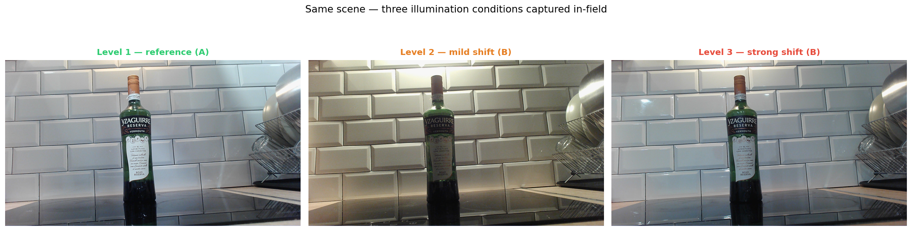
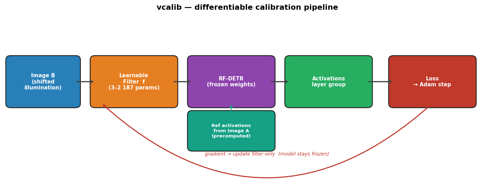
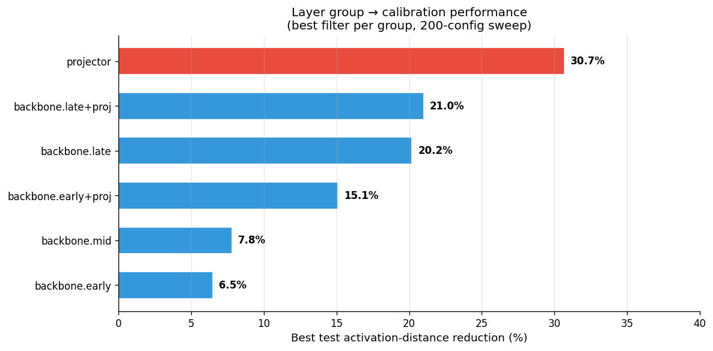
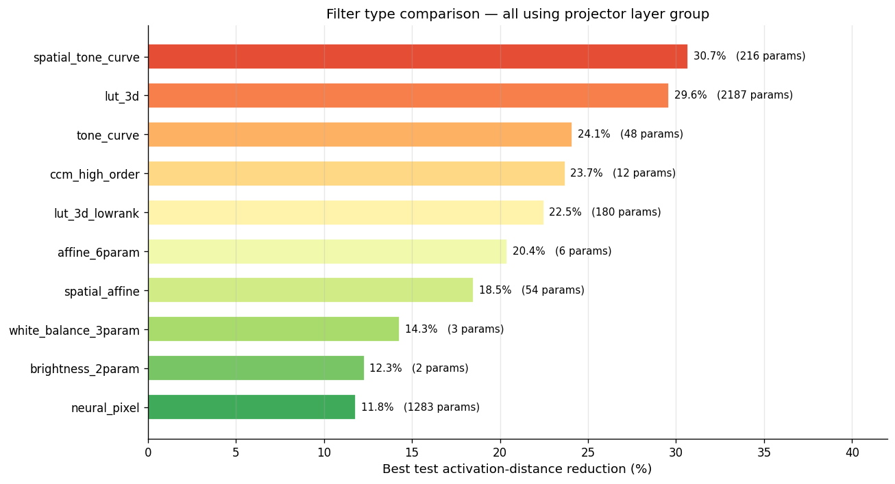
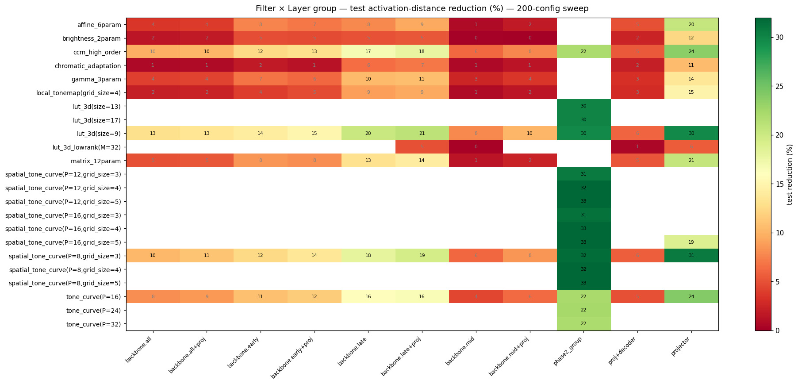

# vcalib — Differentiable Calibration Filters for RF-DETR Under Illumination Shift

> Recover object-detection performance under real-world lighting changes — without retraining the model.

---

## The Problem

RF-DETR is a state-of-the-art real-time object detector. Like most vision models, it is sensitive to illumination conditions: deploy it under different lighting than the training distribution and detection quality degrades. Retraining or fine-tuning is expensive and impractical for edge devices.

**vcalib** learns a tiny preprocessing filter that undoes the illumination shift *before* the image reaches the model. No model weights are changed. Calibration takes seconds on a CPU.

The images below show the same scene captured under three different real-world lighting conditions — the kind of shift that degrades detection performance:



---

## Approach



```
Raw Image B (shifted illumination)
        │
        ▼
┌───────────────────┐
│  Learnable Filter  │  ← optimized in ~100 steps on a single image pair
│  f: [0,1]³→[0,1]³ │    params: 3–2,187 (depending on filter type)
└───────────────────┘
        │
        ▼
ImageNet normalization
        │
        ▼
┌─────────────────────┐        ┌─────────────────────┐
│  RF-DETR  (frozen)  │        │  Reference activations│
│                     │        │  (precomputed from A) │
│  → activations      │◄──────►│                      │
└─────────────────────┘        └─────────────────────┘
        │
        ▼
Loss = mean{ ||act_A[l] - act_filtered_B[l]|| / ||act_A[l]|| }
       for l in chosen layer group
     + reg_weight · filter.reg_loss()
        │
        ▼
Adam optimizer → filter params updated, model frozen
```

**Key design choices:**

- **Signal = intermediate activations, not pixel L2.** We match RF-DETR's internal representations, not pixel values. This gives a task-aware signal.
- **Filter operates pre-normalization** on the `[0, 1]` RGB tensor, before ImageNet mean/std normalization.
- **No model weights modified.** The frozen model acts as a fixed feature extractor. Only the filter is learnable.
- **Layer group as a search axis.** We sweep which group of RF-DETR layers to use as the loss signal. The `backbone.projector` consistently gives the best results.
- **Held-out validation guardrail.** Each calibration is evaluated on a held-out image pair to detect overfitting. An overfit gate (val/train ≥ 0.5) rejects degenerate configs.

---

## Results (200-Config Sweep)

> 10 filter types × 2 illumination levels × 10 layer groups, evaluated on 6 held-out test scenes.  
> Metric: mean activation distance reduction on test set (higher = better).

### Top Configurations

| Rank | Filter | Layer Group | Level | Test Reduction |
|------|--------|-------------|-------|---------------|
| 1 | `spatial_tone_curve` (P=8, K=3) | `projector` | L1→L2 | **30.7%** |
| 2 | `lut_3d` (N=9) | `projector` | L1→L2 | 29.6% |
| 3 | `tone_curve` (P=16) | `projector` | L1→L2 | 24.1% |
| 4 | `ccm_high_order` | `projector` | L1→L2 | 23.7% |
| 5 | `lut_3d` (N=9) | `projector` | L1→L3 | 23.9% |
| 6 | `spatial_tone_curve` (P=8, K=3) | `projector` | L1→L3 | 21.6% |
| 7 | `lut_3d` (N=9) | `backbone.late+proj` | L1→L2 | 21.0% |

### Key Findings

**1. Layer group matters more than filter type.**  
The `projector` layer (backbone's multi-scale feature projector) gives the strongest signal across all filter types. Results degrade progressively from late → mid → early backbone layers.



| Layer Group | Best Test Reduction |
|-------------|-------------------|
| `projector` | **30.7%** |
| `backbone.late+proj` | 21.0% |
| `backbone.late` | 20.2% |
| `backbone.early+proj` | 15.1% |
| `backbone.mid` | 7.8% |

**2. Non-linear filters outperform linear ones.**  
Spatial and tone-curve filters capture the non-linear, per-channel character of real illumination shifts better than affine transforms.



| Filter | Best Test Reduction |
|--------|-------------------|
| `spatial_tone_curve` | **30.7%** |
| `lut_3d` | 29.6% |
| `tone_curve` | 24.1% |
| `ccm_high_order` | 23.7% |
| `affine_6param` | 20.4% |
| `brightness_2param` | 12.3% |

**3. The signal generalizes across illumination levels.**  
Results on `level_1→level_3` (stronger shift) are slightly lower but follow the same filter/group ranking, confirming that the approach is not dataset-specific.

The heatmap below shows the full filter × layer-group matrix — green = better reduction:



Full results: [`results/experiments/experiment_results.csv`](results/experiments/experiment_results.csv) — see [`docs/results_sweep_200.md`](docs/results_sweep_200.md) for the detailed breakdown.

---

## Filter Library

18 parametric filters + 1 neural network filter, all sharing the same interface:

```python
filter(x: Tensor[B, 3, H, W] in [0,1]) → Tensor[B, 3, H, W] in [0,1]
# identity init: filter(x) == x at construction
# end-to-end differentiable
```

| Category | Filter | Params | Targets |
|----------|--------|--------|---------|
| **Global linear** | `brightness_2param` | 2 | global exposure |
| | `white_balance_3param` | 3 | per-channel gains |
| | `affine_6param` | 6 | per-channel affine |
| | `saturation_1param` | 1 | saturation |
| | `contrast_1param` | 1 | global contrast |
| | `gamma_3param` | 3 | per-channel gamma |
| | `matrix_12param` | 12 | 3×3 CCM + offset |
| **Spatial** | `spatial_brightness` | K²·1 | zone-dependent exposure |
| | `spatial_whitebalance` | K²·3 | zone-dependent WB |
| | `spatial_affine` | K²·6 | zone-dependent affine |
| | `spatial_gamma` | K²·3 | zone-dependent gamma |
| **Non-linear** | `lut_3d` | 3·N³ (N=9→2187) | full RGB→RGB LUT |
| | `tone_curve` | 3·P (P=16→48) | monotone per-channel curves |
| | `ccm_high_order` | 3·F+3 | root-polynomial CCM |
| | `chromatic_adaptation` | 3–9 | Bradford LMS adaptation |
| | `spatial_tone_curve` | 3·P·K² | zone-dependent tone curves |
| | `local_tonemap` | K²+1 | CLAHE-like guided gain |
| | `lut_3d_lowrank` | M·(3N+1) | low-rank LUT |
| **Neural** | `neural_pixel` | ~1283 (configurable) | universal approximator |

Spatial filters use a bilinear K×K control grid (`grid_sample`). Default K=3.  
`neural_pixel` is a pixel-wise residual MLP: `f(x) = clamp(x + MLP(x), 0, 1)`, identity-initialized.

---

## Quick Start

### Install

```bash
git clone --recurse-submodules <repo-url>
cd vcalib
uv sync   # creates .venv and installs all deps
```

RF-DETR nano weights download automatically on first run to `3rd_party/libreyolo/weights/`.

### Run a single experiment (dry-run to validate config)

```bash
uv run python run_configs.py configs/experiments/level2_neural_pixel_backbone_all.yaml --dry-run
```

### Run a filter sweep

```bash
uv run python run_configs.py configs/experiments/ --output results/experiments/
```

### Run a single filter against a known-good config

```bash
uv run python run_configs.py configs/experiments/level2_lut3d_projector.yaml
```

### Prepare your own dataset

```bash
# 1. Capture: data/raw/scenes_YYYYMMDD/scene_XXX/{level_1,level_2,...}.jpg
#    level_1 = reference condition A, others = shifted B

# 2. Augment (geometry-preserving)
uv run python scripts/augment_dataset.py \
  --raw data/raw/scenes_YYYYMMDD \
  --out data/augmented --n-aug 5 --seed 42

# 3. Split by illumination level
uv run python scripts/create_datasets.py \
  --augmented data/augmented --out data/datasets
```

### Run tests

```bash
uv run pytest tests/ -v -m "not slow"   # fast (< 5s)
uv run pytest tests/ -v                  # includes smoke calibration (needs data/raw)
```

---

## Project Structure

```
vcalib/
├── src/
│   ├── filters/              # 19 filter implementations + registry
│   │   ├── base.py           # Filter base class (identity init, [0,1] clamping, reg_loss)
│   │   ├── neural_pixel.py   # Pixel-wise residual MLP (new)
│   │   └── ...               # parametric filters
│   ├── utils/
│   │   ├── activations.py    # load_model, ActivationExtractor, LAYER_PATHS
│   │   ├── layer_groups.py   # LayerGroup, 35 predefined groups
│   │   ├── data_pairs.py     # Dataset, discover_pairs, load_pair_tensors
│   │   └── synth_relit.py    # Synthetic relighting for smoke tests
│   ├── calibration.py        # Adam calibration loop, group_loss, overfit gate
│   ├── diagnostics.py        # Phase 1: per-layer distance sweep
│   ├── grid_search.py        # Phase 2: grid executor (legacy)
│   ├── benchmark.py          # Phase 3: proxy mAP recovery (WIP)
│   └── experiment_config.py  # Config schema + loader
├── configs/
│   ├── grid.yaml             # Legacy grid config (35 groups × 17 filters)
│   └── experiments/          # 70 YAML configs (one per experiment)
├── results/
│   └── experiments/
│       ├── experiment_results.csv   # 200-config sweep results
│       └── runs/                    # Per-run checkpoints + metrics.jsonl
├── scripts/
│   ├── augment_dataset.py    # Geometry augmentation preserving A/B pairs
│   ├── create_datasets.py    # Split augmented data by illumination level
│   └── generate_experiment_configs.py
├── tests/                    # 222+ tests (fast + slow smoke)
├── docs/
│   ├── results_sweep_200.md  # Detailed sweep analysis
│   └── specs/                # Design specs
├── run_configs.py            # Main experiment runner (config-driven)
└── 3rd_party/libreyolo/      # RF-DETR wrapper (git submodule)
```

---

## How Experiments Work

Each experiment is a single YAML config:

```yaml
name: level2_neural_pixel_projector
dataset: data/datasets/level_1_vs_level_2
filter:
  type: neural_pixel
  hidden_dim: 32
  depth: 2
layer_group:
  name: projector
  layers:
  - backbone.projector
training:
  max_epochs: 100
  learning_rate: 0.001
  reg_weight: 0.001
  early_stopping_patience: 10
  seed: 42
```

The runner (`run_configs.py`) loads the model once, iterates configs, and writes incremental results. Each run saves `best.pt` (best filter weights) and `metrics.jsonl` (per-epoch stats) under `results/experiments/runs/<name>/`.

---

## Roadmap

| Phase | Status | Description |
|-------|--------|-------------|
| A | ✅ Complete | Filter library (19 filters), calibration loop, tests |
| B | ✅ Complete | Config-driven experiment runner, 70 YAML configs |
| 1 | ⏳ Pending dataset | Diagnostic sweep (per-layer activation distance) |
| 2 | ⏳ Pending Phase 1 | Full grid search on real data |
| 3 | 🔧 In progress | Benchmark: proxy mAP recovery vs. calibration cost |
| D | 📋 Planned | Edge deploy CLI (`deploy_calibrate.py`) |

Current experiments (200-config sweep) were run on synthetically relighted images as a proxy. Real captured dataset is pending.

---

## Stack

- **Python** 3.10+ · **PyTorch** 2.0+ · **transformers** 5.1+
- **Model:** RF-DETR nano via [LibreYOLO](https://github.com/ultralytics/libreyolo) (git submodule)
- **Package manager:** [uv](https://github.com/astral-sh/uv)
- **Dev:** pytest · ruff · mypy

---

## Citation / Contact

This is active research. Results and APIs may change. Feel free to open an issue or reach out.
